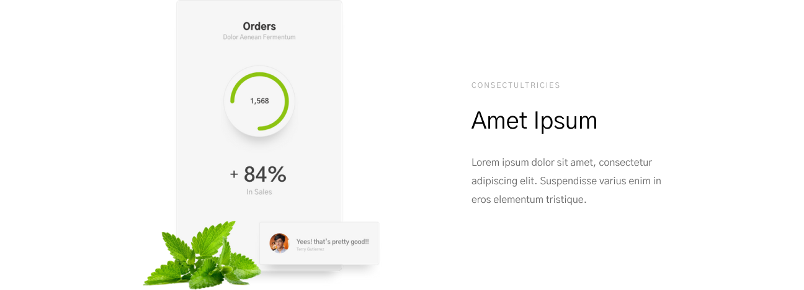

# Задание 1
```
.head
.head__eyes .head__eyes--color_
.head__mouth .head__mouth--size_
.head__nose .head__nose--type_

.body
.body__skin .body__skin--color_
.body__build .body__build--type_
.body__arms .body__arms--length_

.legs
```
## Задание 2


```
header.header>div.container>nav.nav>ul.nav__list>li.nav__item>a.nav__link
```


```
section.cards-section>div.container>div.cards>div.cards__item>img.cards__img+div.cards__text-container.text-container>p.text-container__slogan+p.text-container__head+p.text-container__main
```


```
section.form-section>div.container>form.form>h2.form__head+p.form__text+div.form__btn-container.btn-container>input.btn-container__text-btn+input.btn-container__subscribe-btn
```


```
footer.footer>div.container>nav.nav-footer>img.nav-footer__logo+ul.nav-footer__links.links>li.links__item>a.links__link
```

